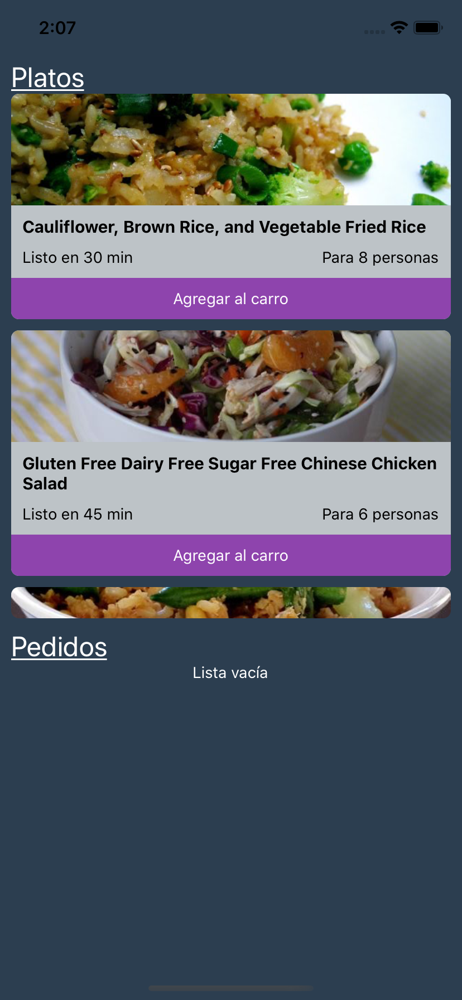
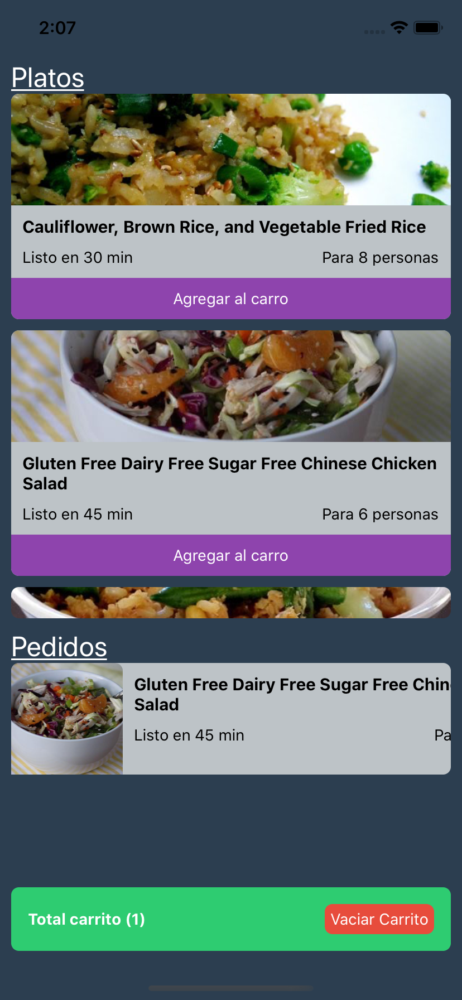
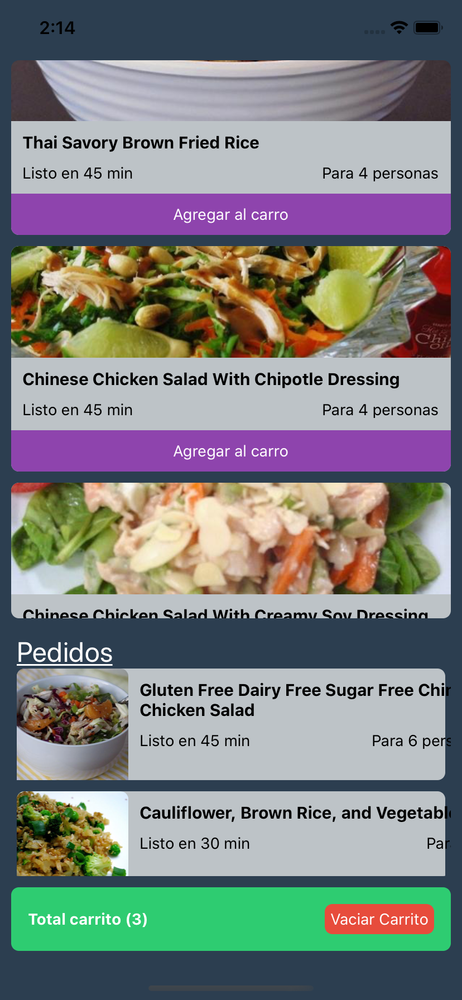

# Tarea 2

Revisen bien las instrucciones y las imágenes!

### Generar un carrito de compras

Junto a lo que desarrollamos la clase del día Jueves 12, desarrollar una lista con platos, agregar un carrito de compras que mostrará un número con la cantidad e elementos en el carrito y un botón `Vaciar Carrito`.

**Bonus**

Tarea bonus corresponde en hacer otra lista que muestre efectivamente la lista de elementos agregados.

---

Recuerden que el proyecto correspondiente está en el siguiente enlace:

[Proyecto React Native Escalab](https://github.com/JuliusEscalab/react_native_gen1_3_11_20)

Correspondiente a la Clase 3 (estados) y 4 (props).

### Tarea Principal:

- Las cajitas deben tener (importante) un botón de **Agregar al Carro**
- Una vez presionan el botón de **Agregar al Carro**, este debe guardar el elemento en otro estado y levantar un componente de carrito mostrado en la imagen 2
- Cuando agreguen al carrito, deberá aparecer una `Alerta` que diga que fue agregado al carrito!
- **OJO!** deben validar que el mismo item no se agregue 2 veces
- El `carrito` de la imagen 2 parte inferior, debe incluir información de cuántos elementos hay en el carrito actualmente
- El `carrito` de la imagen 2 parte inferior, debe incluir un botón `Vaciar Carrito`, que levantará una `Alerta` de confirmación como en la imagen 3
- Al vaciar el carrito, debería desaparecer el `carrito de compras`

### Bonus track (también da décimas, pero es más desafiante 👀):

- Generar otro **FlatList** que contenga los elementos del carrito (permita hacer scroll)
- Considerar el cambio de diseño. Tengan ojo con el diseño de ambos flatlist, aunque no voy a considerar en si tanto el diseño de tener 2 flatlists en una misma vista, para que tenga consideración que el primer flatlist debe tener `flexGrow: 0, height: depende_de_su_diseño` en su estilo.

---

#### Imagen 1 (imágenes con botón agregar al carro)


#### Imagen 2 (alerta al presionar "agregar al carro")


#### Imagen 3 (alerta al presionar "Vaciar Carrito")


## Parte del bonus

Para los titulos `Platos` y `Pedidos`, FlatList tiene un prop llamado `ListHeaderComponent` como función, es decir:

```js
<FlatList
  ...
  ListHeaderComponent={() => (<Componente />)}
/>
```

#### Imagen 4


#### Imagen 5


#### Imagen 6
