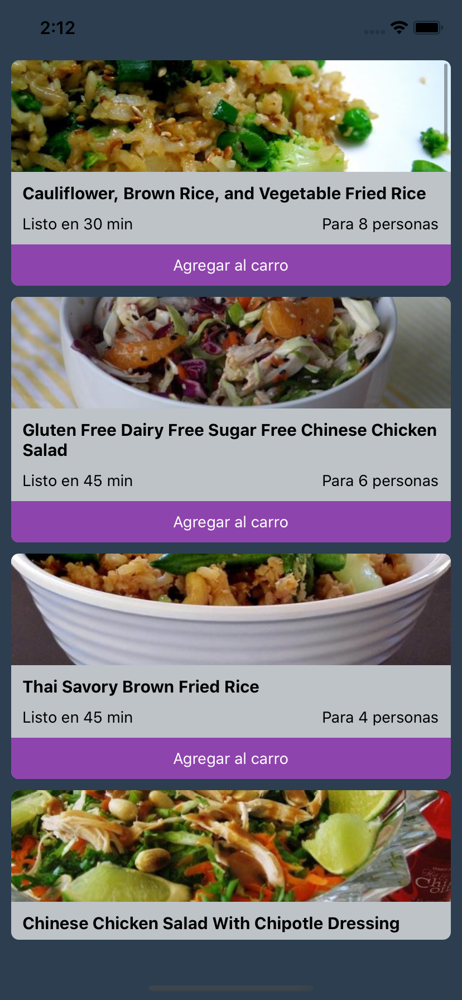
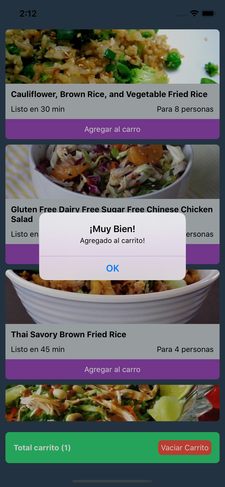
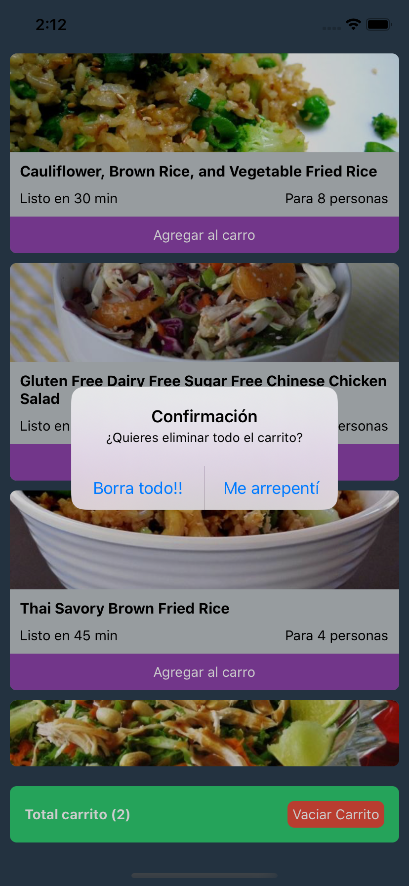

# Tarea

### Clase 4

#### Generar un carrito de compras + bonus, lista con elementos del carrito

Junto a lo que desarrollamos la clase del día Jueves 12, desarrollar una lista con platos.

Junto al JSON que dejaré como un archivo.

Tarea Principal:

- Las cajitas deben tener (importante) un botón de **Agregar al Carro**
- Una vez presionan el botón de **Agregar al Carro**, este debe guardar el elemento en otro estado y levantar un componente de carrito mostrado en la imagen 2
- Cuando agreguen al carrito, deberá aparecer una `Alerta` que diga que fue agregado al carrito!
- **OJO!** deben validar que el mismo item no se agregue 2 veces
- El `carrito` de la imagen 2 parte inferior, debe incluir información de cuántos elementos hay en el carrito actualmente
- El `carrito` de la imagen 2 parte inferior, debe incluir un botón `Vaciar Carrito`, que levantará una `Alerta` de confirmación como en la imagen 3
- Al vaciar el carrito, debería desaparecer el `carrito de compras`

Bonus track (también da décimas, pero es más desafiante 👀):

- Generar otro **FlatList** que contenga los elementos del carrito (permita hacer scroll)
- Considerar el cambio de diseño. Tengan ojo con el diseño de ambos flatlist, aunque no voy a considerar en si tanto el diseño de tener 2 flatlists en una misma vista, para que tenga consideración que el primer flatlist debe tener `flexGrow: 0, height: depende_de_su_diseño` en su estilo.

#### Imagen 1

#### Imagen 2

#### Imagen 3

## Parte del bonus

#### Imagen 4

#### Imagen 5

#### Imagen 6
