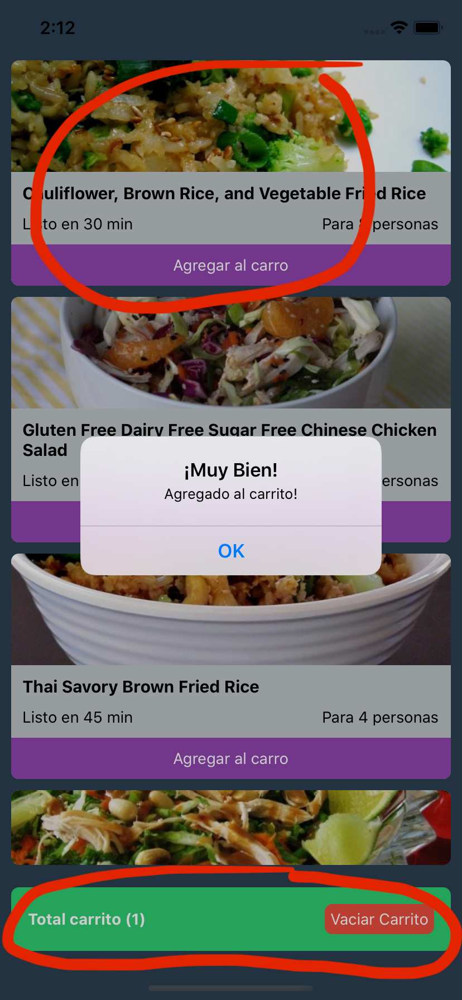

# Tarea 3

# Continuación de la tarea 2

Junto con el desarrollo de la tarea 2, solamente les pediré que ambos componentes:

* La tarjeta de cada plato
* Carrito

Ambos marcados con ciruclos rojos, sean desarrollados como componentes funcionales.

#### Imagen 1 (imágenes con botón agregar al carro)

## Ambas tareas 2 y 3 pueden ser entregadas al mismo tiempo.